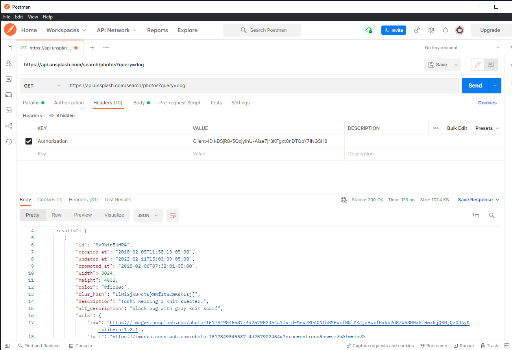

This is a [Next.js](https://nextjs.org/) project bootstrapped with [`create-next-app`](https://github.com/vercel/next.js/tree/canary/packages/create-next-app).

## Getting Started

First, run the development server:

```bash
npm run dev
# or
yarn dev
```

## Deployed on codesandbox

https://codesandbox.io/s/upbeat-voice-8t2eo

## Github

https://github.com/benhalverson/unsplash-api-app

In this repo I built a simple search app using the unsplash API. In it we are using
`https://api.unsplash.com/search/photos` as the endpoint. To use the API you need an API key which you can get from the [unsplash website](https://unsplash.com/developers).
Once you have a key, add it to the `.env` file to use it in the app and add an Authorization header to the request.
```bash
#.env
UNSPLASH_ACCESS_KEY=<your-api-key>
```
Before building anything I like to use Postman to test the API. Here's a screenshot of how it looks:


To do the search it expects a parameter called query. If you look in the network tab you can see the request looks like this: `https://api.unsplash.com/search/photos?query=dogs`


Also in the network tab you can see that the request is a `get` request and has an authorization header. 
Without the authorization header the request will not work.

The response can be seen under preview or response. 
The payload is your query param.

In React you will need to use setState to set the query value.
The first value is the initial value, the second is the function that will be called when the value changes.

```tsx
const [search, setSearch] = useState("");
```

The search button will call the function `handleSubmit` which will call `getPhotos` with the value of the search input an

If the response is successful, it will set the state of the photos to the response.

```tsx
    const getPhotos = async () => {
    try {
      const response = await axios.get(
        "https://api.unsplash.com/search/photos",
        {
          headers: {
            Authorization: `Client-ID ${process.env.UNSPLASH_ACCESS_KEY}`,
          },
          params: {
            query: `${search}`,
          },
        }
      );

      const photos = response.data.results;
      if (photos) {
        setImages(photos);
      }
      return photos;
    } catch (error: any) {
      console.error("Failed to load images", error.message);
    }
  };

```

`images` is now an array of objects. We will pass this data into the `ImageList` component. where we will map over the array and return a `ImageCard` component for each object.

```tsx
<ImageList images={images} />
```

I also created a `UserInfo` component that takes in metadata about the photographer and displays it.

```tsx
<UserInfo
  name={image.user.username}
  bio={image.user.bio}
  portfolioURL={image.user.portfolioURL}
  twitterUsername={image.user.twitterUsername}
/>
```

The styling of this app was done with tailwindcss. I followed the [tailwindcss docs](https://tailwindcss.com/docs/guides/nextjs) to setup the tailwind.config.js file.

Under the API folder I created a mock API because the unsplash API has a rate limit of 50 requests per hour and was quickly getting annoying. I took the response from the API and created a mock response and duplicated the getPhotos fuction to return the mock response by calling the /api/unsplash endpoint form Nextjs.
